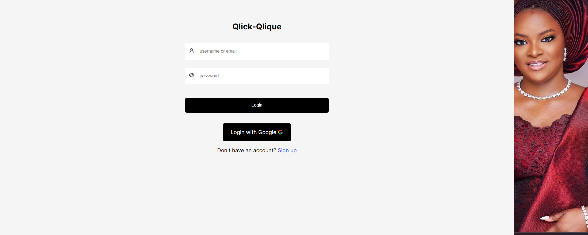

# React + Vite

A minimalist social media application that focuses on building meaningful connections.

Installation 
To install the project, follow these steps:

Clone the repository

bash Copy code git clone https://github.com/Ekpenga9000/qlick-qlique-client

VITE_SERVER_URL=<this is the URL to the server> 
VITE_CLIENT_URL=<The client URL>

This template provides a minimal setup to get React working in Vite with HMR and some ESLint rules.

Currently, two official plugins are available:

- [@vitejs/plugin-react](https://github.com/vitejs/vite-plugin-react/blob/main/packages/plugin-react/README.md) uses [Babel](https://babeljs.io/) for Fast Refresh
- [@vitejs/plugin-react-swc](https://github.com/vitejs/vite-plugin-react-swc) uses [SWC](https://swc.rs/) for Fast Refresh
